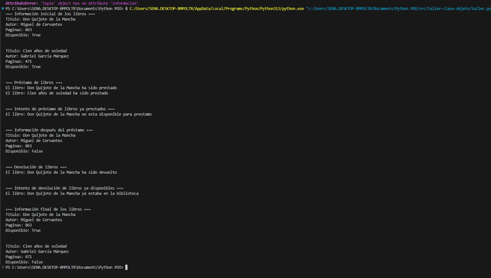
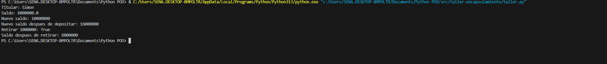

# Documentación de Ejemplos: Clases y Objetos en Python

Esta carpeta contiene varios ejemplos prácticos sobre el uso de clases y objetos en Python. A continuación se explica el propósito y funcionamiento de cada archivo.

---

## ejemplo1.py

**Descripción:**  
Introduce la definición básica de una clase (`Persona`) y la creación de objetos.  
**Contenido:**  
- Se define la clase `Persona` con atributos: `nombre`, `edad` y `caracteristicas`.
- Se crean dos objetos (`ana` y `juan`) y se accede a sus atributos usando `print`.

**Objetivo:**  
Mostrar cómo se definen clases y cómo se instancian objetos en Python.

---

## ejemplo2.py

**Descripción:**  
Agrega métodos a la clase para mostrar información y modificar atributos.  
**Contenido:**  
- Clase `Producto` con atributos: `nombre`, `precio`, `stock`.
- Métodos para mostrar información del producto y actualizar el stock.

**Objetivo:**  
Demostrar cómo agregar comportamientos (métodos) a una clase y cómo interactuar con ellos desde los objetos.

---

## ejemplo3.py

**Descripción:**  
Introduce el concepto de métodos especiales y el uso de `__str__`.  
**Contenido:**  
- Clase `Libro` con atributos: `titulo`, `autor`, `anio`.
- Implementa el método especial `__str__` para mostrar información legible del objeto.

**Objetivo:**  
Explicar cómo personalizar la representación en texto de los objetos usando métodos especiales.

---

## ejemplo4.py

**Descripción:**  
Muestra el uso de atributos y métodos de clase (compartidos por todas las instancias).  
**Contenido:**  
- Clase `CuentaBancaria` con un atributo de clase para llevar el conteo de cuentas creadas.
- Métodos para depositar y retirar dinero.

**Objetivo:**  
Enseñar la diferencia entre atributos de instancia y atributos de clase, y cómo usarlos.

---

## ejemplo5.py

**Descripción:**  
Explica el concepto de encapsulamiento y el uso de atributos privados.  
**Contenido:**  
- Clase `Empleado` con atributos privados (usando doble guion bajo `__`).
- Métodos para acceder y modificar los atributos privados de forma controlada.

**Objetivo:**  
Mostrar cómo proteger los datos internos de una clase y cómo acceder a ellos de manera segura.

---

## ejemplo6.py

**Descripción:**  
Presenta el uso de métodos de clase y métodos estáticos.  
**Contenido:**  
- Clase `Fecha` con métodos de clase para crear fechas desde diferentes formatos.
- Método estático para validar si una fecha es válida.

**Objetivo:**  
Demostrar cómo crear métodos que no dependen de una instancia específica y cómo usarlos para construir objetos o realizar validaciones.

---

## Resumen

Cada archivo aborda un aspecto fundamental de la Programación Orientada a Objetos en Python, desde la definición básica de clases y objetos hasta conceptos más avanzados como métodos especiales, atributos de clase, encapsulamiento y métodos estáticos.  
Revisa cada archivo para ver ejemplos prácticos y entender cómo aplicar estos conceptos en tus propios proyectos.

-----------
# Documentación de Ejemplos: Encapsulamiento en Python

Esta carpeta contiene ejemplos prácticos sobre el concepto de **encapsulamiento** en la Programación Orientada a Objetos con Python. A continuación se explica el propósito y funcionamiento de cada archivo.

---

## ejemplo1.py

**Descripción:**  
Introduce el concepto de atributos protegidos y privados en una clase.

**Contenido:**  
- Se define una clase con atributos protegidos (un guion bajo, por convención) y privados (doble guion bajo, para name mangling).
- Se muestra cómo acceder a estos atributos desde dentro y fuera de la clase.

**Objetivo:**  
Comprender la diferencia entre atributos protegidos y privados, y cómo Python maneja el acceso a ellos.

---

## ejemplo2.py

**Descripción:**  
Explica el uso de métodos getter y setter para controlar el acceso a los atributos.

**Contenido:**  
- Se define una clase con atributos protegidos.
- Se implementan métodos para obtener y modificar los valores de los atributos de forma controlada.

**Objetivo:**  
Aprender a usar getters y setters para validar y proteger los datos internos de una clase.

---

## ejemplo3.py

**Descripción:**  
Demuestra el encapsulamiento en clases con herencia y el acceso a atributos protegidos y privados.

**Contenido:**  
- Se definen clases con atributos protegidos y privados.
- Se muestra cómo una subclase puede acceder a atributos protegidos pero no a los privados.
- Incluye validaciones y manejo de errores al intentar acceder a atributos privados desde una subclase.

**Objetivo:**  
Entender cómo el encapsulamiento afecta la herencia y el acceso a los datos en clases derivadas.

---

## ejemplo4.py

**Descripción:**  
Presenta el uso de getters y setters con validaciones para atributos, mostrando cómo controlar el acceso y la modificación de los datos.

**Contenido:**  
- Clase `Persona` con atributos protegidos.
- Métodos getter y setter para cada atributo, incluyendo validaciones (por ejemplo, que la edad sea un número válido).
- Ejemplo de uso: creación de un objeto, acceso y modificación de atributos, y manejo de errores al intentar asignar valores no válidos.

**Objetivo:**  
Practicar el uso de métodos de acceso y modificación con validaciones para proteger la integridad de los datos.

---

## ejemplo5.py

**Descripción:**  
Introduce el uso de propiedades (`@property`) en Python para un acceso más elegante y seguro a los atributos.

**Contenido:**  
- Clase con atributos privados.
- Uso de decoradores `@property` y `@<atributo>.setter` para definir getters y setters de manera más "pythónica".
- Ejemplo de cómo acceder y modificar atributos usando la sintaxis de atributos, pero con validaciones internas.

**Objetivo:**  
Aprender a utilizar propiedades para encapsular atributos de forma más sencilla y segura, siguiendo las buenas prácticas de Python.

---

## Resumen

Cada archivo aborda un aspecto fundamental del **encapsulamiento** en Python, desde la protección básica de atributos hasta el uso de propiedades y validaciones.  
Revisa cada archivo para ver ejemplos prácticos y entender cómo aplicar estos conceptos para proteger y controlar el acceso a los datos en tus propias clases.

## Capturas de los codigos corriendo

# Taller de Clases y Objetos en Python

Este taller presenta un ejemplo práctico de cómo modelar un sistema sencillo de gestión de libros en una biblioteca utilizando los conceptos fundamentales de **clases** y **objetos** en Python.

---

## Archivo: `taller.py`

### Descripción General

El archivo `taller.py` contiene la definición de la clase `Libro` y una función principal (`main`) que simula el ciclo de préstamo y devolución de libros. Este ejemplo te ayudará a comprender cómo se crean objetos, cómo se encapsulan los datos y cómo se definen métodos para manipular el estado de los objetos.

---

### Clase `Libro`

#### **Atributos**
- `titulo`: Título del libro.
- `autor`: Autor del libro.
- `paginas`: Número de páginas del libro.
- `disponible`: Indica si el libro está disponible para préstamo (por defecto, `True`).

#### **Métodos**
- `prestar()`:  
  Si el libro está disponible, cambia su estado a no disponible y devuelve un mensaje indicando que el libro ha sido prestado.  
  Si ya está prestado, devuelve un mensaje indicando que no está disponible para préstamo.

- `devolver()`:  
  Si el libro estaba prestado, cambia su estado a disponible y devuelve un mensaje indicando que el libro ha sido devuelto.  
  Si el libro ya estaba disponible, devuelve un mensaje indicando que ya estaba en la biblioteca.

- `informacion()`:  
  Devuelve una cadena con la información detallada del libro (título, autor, páginas y estado de disponibilidad).

---

### Función `main()`

La función principal realiza los siguientes pasos:

1. **Crea dos objetos `Libro`** con diferentes títulos, autores y número de páginas.
2. **Muestra la información inicial** de ambos libros.
3. **Presta ambos libros** y muestra los mensajes correspondientes.
4. **Intenta prestar un libro ya prestado** para mostrar el control de disponibilidad.
5. **Muestra la información después del préstamo**.
6. **Devuelve un libro** y muestra el mensaje correspondiente.
7. **Intenta devolver un libro que ya está disponible** para mostrar el control de estado.
8. **Muestra la información final** de ambos libros.

---

## ¿Qué se aprende con este taller?

- Cómo definir una clase con atributos y métodos.
- Cómo crear objetos (instancias) de una clase.
- Cómo controlar el estado interno de un objeto usando métodos.
- Cómo validar acciones según el estado del objeto (por ejemplo, no prestar un libro ya prestado).
- Cómo mostrar información de los objetos de manera clara.

---

## Captura

----
**Este taller es ideal para afianzar los conceptos básicos de la Programación Orientada a Objetos en Python mediante un ejemplo real y fácil de entender.**

# Taller de Encapsulamiento en Python

Este taller muestra cómo aplicar el **encapsulamiento** en la Programación Orientada a Objetos usando Python, a través de la simulación de una cuenta bancaria. El objetivo es que comprendas cómo proteger los atributos de una clase y controlar el acceso a ellos mediante métodos (getters y setters), así como validar operaciones sobre los datos internos.

---

## Archivo: `taller.py`

### Descripción General

El archivo contiene la definición de la clase `CuentaBancaria` y ejemplos de uso. La clase representa una cuenta bancaria con un titular y un saldo, e implementa métodos para consultar, modificar y operar sobre el saldo de forma segura.

---

### Clase `CuentaBancaria`

#### **Atributos**
- `_titular`: Nombre del titular de la cuenta (protegido).
- `_saldo`: Saldo actual de la cuenta (protegido).

#### **Métodos**
- `get_titular()`: Devuelve el nombre del titular.
- `get_saldo()`: Devuelve el saldo actual.
- `set_saldo(nuevo_saldo)`: Permite modificar el saldo solo si el valor es numérico y no negativo.
- `depositar(cantidad)`: Suma la cantidad al saldo solo si es positiva y numérica. Devuelve `True` si la operación fue exitosa, `False` en caso contrario.
- `retirar(cantidad)`: Resta la cantidad al saldo solo si es positiva, numérica y no supera el saldo disponible. Devuelve `True` si la operación fue exitosa, `False` en caso contrario.

---

# Imagenes

---

### ¿Qué se aprende con este taller?

- Cómo proteger los atributos de una clase usando la convención de guion bajo (`_`).
- Cómo usar métodos getter y setter para acceder y modificar atributos de forma controlada.
- Cómo validar operaciones para evitar estados inconsistentes (por ejemplo, saldo negativo).
- Cómo implementar métodos que devuelvan información sobre el éxito o fracaso de una operación.

---

### 📌Reflexion

Durante el desarrollo de este proyecto de Python y Programación Orientada a Objetos (POO), tuve la oportunidad de reforzar y aplicar conceptos fundamentales como la encapsulación, el uso de clases y métodos, así como la creación de programas más estructurados y fáciles de mantener.
Uno de los principales aprendizajes fue comprender cómo organizar el código en funciones y módulos, lo que me permitió desarrollar un sistema más ordenado y reutilizable. Además, aprendí a trabajar con estructuras de datos como diccionarios y listas para gestionar información de manera eficiente.

**Este taller es ideal para comprender y practicar el encapsulamiento, uno de los pilares de la Programación Orientada a Objetos en Python.**

